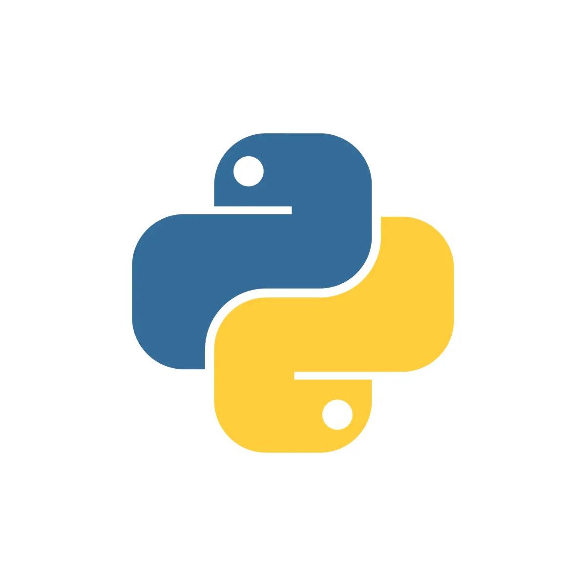

# Hi there 👋 I'm Hasan Ahmadi

### Full-Stack Developer | AI/Machine Learning Engineer | Python Specialist

---

## 👨‍💻 About Me

### Hi, I'm Hasan Ahmadi!
An enthusiastic programmer with a deep interest in **Python**, **Linux environments**, and the fields of **Machine Learning & Deep Learning**.

### 🔹 My Approac
I believe the best way to learn is by doing. My learning philosophy is centered around "learning by building"—focusing on developing small, practical, and hands-on projects to gain a deep, fundamental understanding of complex concepts.

### 🔹 Interests & Goals
Beyon exploring AI algorithms, I am passionate about practicing **Clean Code** principles, leveraging **Open Source** tools, and mastering **Bash/Terminal scripting**. My ultimate goal is to become a developer capable of solving real-world problems with reliable code and meaningful data insights.

---

## 🛠️ Technical Skills

- **Languages:** Python, JavaScript, c++, 
- **Web Development:** Django, REST APIs
- **Machine Learning:** Deep Learning, TensorFlow, PyTorch
- **Tools & Systems:** Linux, Git, Docker
- **Databases:** SQL, NoSQL

---

## 🚀 Current Focus

- 🔭 **Working on:** Deep Learning projects and AI model optimization
- 🌱 **Learning:** Advanced Machine Learning techniques and Neural Networks
- 👯 **Open to:** Collaborating on web development and AI/ML projects
- 🤔 **Seeking Help With:** Deep Learning optimization strategies
- 💬 **Ask Me About:** Python programming, web development, and machine learning

---

## 🌐 Connect With Me

---

## 📊 GitHub Statistics

---

**Let's build something amazing together! 🚀**

